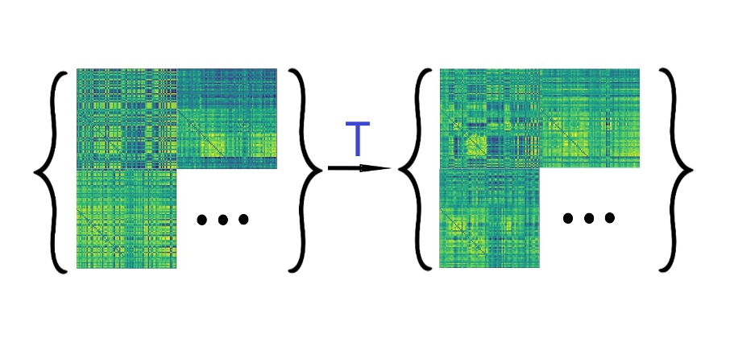

# Rest2Task: Generate task-based fMRI using resting state fMRI image-to-image task

## Overview

This repository provides a tool for generating task-based fMRI functional connectivity matrices from resting-state fMRI (rs-fMRI) using image-to-image mapping. The primary objective is to create task-related connectivity matrices, simulating different tasks, as included in the [Human Connectome Project (HCP)](https://www.humanconnectome.org/study/hcp-young-adult/data-releases) dataset.

*Figure 1: Overview of the connectivity matrices estimation process, showing the workflow from raw data input through preprocessing steps.*

## Motivation

While task-based fMRI is essential for understanding brain function during specific activities, collecting task-based data can be resource-intensive and time-consuming. This tool leverages resting state fMRI data and mapping techniques from Optimal Transport theory to create task-related fMRI data, offering a cost-effective and efficient approach for researchers.

*Figure 2: Schema illustrating the transfer of fMRI patterns to task-specific domains.*

## Features

- **Task Generation**: Transform resting-state fMRI connectivity matrices into task-specific fMRI data for multiple tasks (e.g., EMOTION, GAMBLING, LANGUAGE, MOTOR, RELATIONAL, Working Memory, SOCIAL) from the HCP dataset.
- **Customization**: Adjust parameters to fine-tune the task generation process.

## Getting Started

To get started with using this tool, follow the instructions provided in the readme.md and ensure you have the required dependencies installed.

## Usage

1. **Data Preparation**: Ensure you have the HCP resting-state fMRI connectivity matrices as input data.
2. **Configuration**: Adjust the tool's parameters as needed, specifying the desired task (e.g., EMOTION, GAMBLING) and other options.
3. **Run the Generator**: Execute the notebooks to generate task-based fMRI data.

## Model Performance Comparison

| Model Score | VAE | cGAN | WcGAN-QC | Vanilla NOT |
|-------------|-----|------|----------|-------------|
| **MSE score** | 0.07 ± 0.25 | 0.06 ± 0.01 | **0.05 ± 0.01** | 0.06 ± 0.03 |
| **L1** | 0.69 ± 0.25 | 0.19 ± 0.01 | **0.18 ± 0.01** | 0.22 ± 0.03 |

*Table 1: Comparison of reconstruction quality metrics across different generative models*

## Matrices generated by WcGAN-QC from several subjects

## License

This project is licensed under the [Skoltech Academic License](https://skoltech.link.sendsay.ru/skoltech/5934,=0eFJuHmzJ2ZpovBFJQumjvg/8326,2649009,104417,?aHR0cHM6Ly93d3cuc2tvbHRlY2gucnUvYXBwL2RhdGEvdXBsb2Fkcy8yMDIzLzA5L1NBTF92LjEuMF9FTi5wZGY=).

## Contact

For questions, suggestions, or issues, please feel free to [contact us](mailto:ekaterina.antipushina@skoltech.ru).

