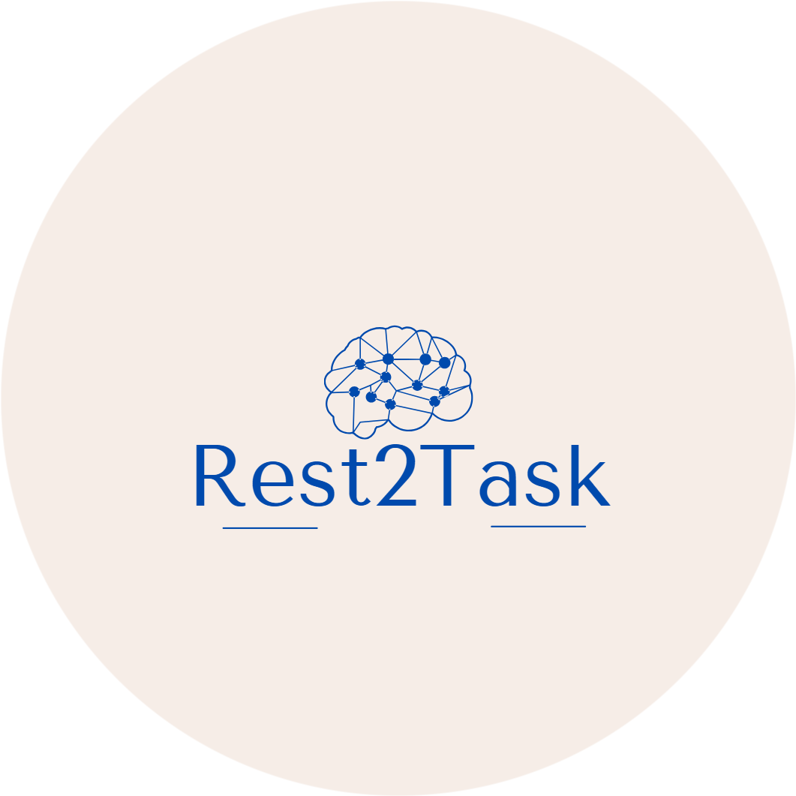

# Rest2Task:   <h3> Generate-task-based-fMRI-using-resting-state-fMRI-image-to-image-task-Resting State to Task-based fMRI Generator </h3>

## Overview

This repository provides a tool for generating task-based functional Magnetic Resonance Imaging (fMRI) data from resting-state fMRI (rs-fMRI) using image-to-image mapping. The primary objective is to create task-related connectivity matrices, simulating different tasks, as included in the [Human Connectome Project (HCP)](https://www.humanconnectome.org/study/hcp-young-adult/data-releases) dataset.

## Motivation

While task-based fMRI is essential for understanding brain function during specific activities, collecting task-based data can be resource-intensive and time-consuming. This tool leverages resting state fMRI data and mapping techniques to create task-related fMRI data, offering a cost-effective and efficient approach for researchers.

## Features

- **Task Generation**: Transform resting-state fMRI connectivity matrices into task-specific fMRI data for multiple tasks (e.g., EMOTION, GAMBLING, LANGUAGE, MOTOR, RELATIONAL, Working Memory, SOCIAL) from the HCP dataset.
- **Customization**: Adjust parameters to fine-tune the task generation process.
- **Data Augmentation**: Create a variety of task-related fMRI datasets for experimentation and analysis.

## Getting Started

To get started with using this tool, follow the instructions provided in the [Documentation](documentation-link) and ensure you have the required dependencies installed.

## Usage

1. **Data Preparation**: Ensure you have the HCP resting-state fMRI connectivity matrices as input data.
2. **Configuration**: Adjust the tool's parameters as needed, specifying the desired task (e.g., EMOTION, GAMBLING) and other options.
3. **Run the Generator**: Execute the notebooks to generate task-based fMRI data.
4. **Data Analysis**: Utilize the generated task-based data for your analyses and research.

## License

This project is licensed under the [Skoltech Academic License](https://skoltech.link.sendsay.ru/skoltech/5934,=0eFJuHmzJ2ZpovBFJQumjvg/8326,2649009,104417,?aHR0cHM6Ly93d3cuc2tvbHRlY2gucnUvYXBwL2RhdGEvdXBsb2Fkcy8yMDIzLzA5L1NBTF92LjEuMF9FTi5wZGY=).

## Acknowledgments

- This project was inspired by the need to generate task-based fMRI data efficiently for neuroimaging research.
- Special thanks to the Human Connectome Project (HCP) for providing valuable resting state and task-based fMRI data.

## Contact

For questions, suggestions, or issues, please feel free to [contact us](mailto:your-email@example.com).

       

---

[Insert Project Logo Here]

